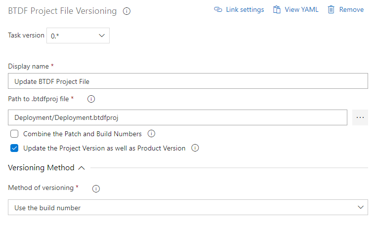

# Description

Azure DevOps build task to modify the BTDF Project file (*.btdfproj) that creates the MSI.

This will take the preferred version number source and update the BTDF Project file **ProductVersion**, optionally the **ProjectVersion** and generates a new GUID for the **ProductId**

Version number source can be chosen from the following : 

* Build Number variable Build.BuildNumber
* Environment Variable of your choice
* GitVersion properties, specifically *MajorMinorPatch* and combines *CommitsSinceVersionSource*

This plugin is heavliy based on the [BTDF Project Updater](https://marketplace.visualstudio.com/items?itemName=MacrossPlusInc.BTDFProjectUpdater), rewritten in Typescript with the additional option to update the **ProjectVersion** tag to prevent overwriting start menu options when opting for a side by side upgrade stragey.

## Why

MSI packages have a limit of Major.Minor.Path, but with [Sematic Version](https://semver.org) and [GitVersion](https://gitversion.readthedocs.io/en/latest/) version numbers like "1.2.3-ci4" or "1.2.3+4" can be generated and using the CombinePatchBuildNumbers option, this plugin will convert these formats to Major.Minor.<2 Digit Patch><3 digit Build>.

For Example : 

* 1.2.3.4 => 1.2.03004
* 1.2.3-alpha.1 => 1.2.03001
* 1.2.3-rc.1 => 1.2.03001
* 1.2.3+4 => 1.2.03004

## Why the padding of zeros?

MSI Patch number has a limitiation value of 65,535, which is 5 characters long. For simplicity, this value is split into 2 and 3 digits representing a 2 digit patch number (max 65) and a 3 digit build number (max 999 except for when the build number is 65 where the limit is 535). This should be well within range for most BizTalk projects before a minor increase is required.

## Considerations

The Git version capture is taken from the source project and as such has not been tested and should be considered experimental, but any bugs or pull requests can be raised for investigation at the github project [here](https://github.com/catofstealth/vsts-btdf-projver-task)

